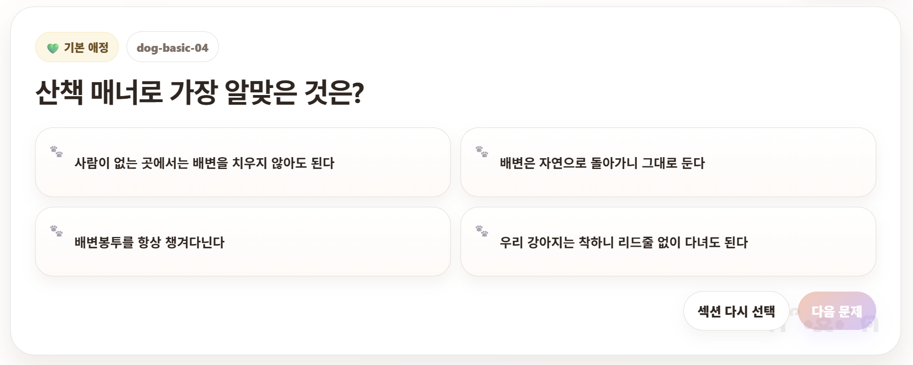

# 🐾 나는 몇점짜리 견주/집사일까?

반려동물 보호자를 위한 랜덤 퀴즈 웹앱

## 📖 무엇을 하는 프로젝트인가?

사용자가 견주(강아지 보호자) 또는 집사(고양이 보호자) 테스트를 선택하여 자신의 반려동물 지식을 점검할 수 있는 웹 애플리케이션입니다.

각 테스트는 기본·실전·박사 난이도의 문제들로 구성되며, 매번 랜덤으로 출제됩니다. 문제 풀이 후 점수와 답변 리뷰를 제공하여 보호자로서의 강점과 보완할 점을 확인할 수 있습니다.

## 🚀 사용 방법

1. 메인 화면에서 **견주 테스트** 또는 **집사 테스트**를 선택합니다.
2. 출제된 10개의 문제에 답변합니다.
3. 각 문제의 해설을 확인하며 다음 문제로 이동합니다.
4. 모든 문제를 완료하면 최종 점수와 결과 분석을 확인할 수 있습니다.
5. 원하는 경우 같은 섹션을 다시 풀거나 다른 섹션에 도전할 수 있습니다.

## 📸 사용 예시

### 시작 화면

  

- 견주 테스트 / 집사 테스트 선택
- 문제 난이도 구성 안내
- 랜덤 퀴즈 시작

### 문제 풀이 화면

  

- 현재 문제 번호 표시
- 객관식 답안 선택
- 실시간 점수 확인
- 문제별 해설 제공

### 결과 화면
- 최종 점수 확인
- 보호자 등급 표시
- 답변 리뷰 제공
- 다시 도전 기능 제공

---

## 📥 입력 / 출력

| 입력(Input) | 출력(Output) |
|------------|--------------|
| 견주 테스트 선택 | 강아지 관련 랜덤 10문항 출제 |
| 집사 테스트 선택 | 고양이 관련 랜덤 10문항 출제 |
| 객관식 답안 선택 | 점수 계산 및 해설 제공 |
| 모든 문제 풀이 완료 | 최종 점수, 등급, 답변 리뷰 제공 |

---

## 🎬 데모

[데모 보기](https://사용자이름.github.io/저장소이름/)

---

## 🚧 아직 안 되는 것

- 사용자 점수 저장 기능
- 회원가입 및 로그인 기능
- 보호자 통계 분석 기능
- 문제 직접 추가 기능
- 결과 공유 기능
- 다국어 지원
- 실제 반려동물 건강 진단 기능

현재 버전은 브라우저에서 동작하는 단일 HTML 기반 퀴즈 애플리케이션입니다.
